# Automatic Maintenance

## Synopsis

This GitHub Action provides an _opinionated workflow_ for performing automatic maintenance tasks on a repository. It can be used to automate tasks such as updating dependencies, formatting code, etc.

The maintenance workflow is depicted in the following state diagram:

```mermaid
stateDiagram-v2
  UserScripts: User Scripts

  Prepare: prepare-script
  Check: check-script
  Change: change-script
  Verify: verify-script
  Commit: commit-script

  MergeChanges: Merge the changes to the target branch

  state check_if_state <<choice>>
  state user_scripts_if_state <<choice>>

  state UserScripts {
    [*] --> Prepare
    Prepare --> Check

    Check --> check_if_state
    check_if_state --> [*]: exit_code = 0
    check_if_state --> Change: exit_code ≠ 0

    Change --> Verify
    Verify --> Commit
    Commit --> [*]
  }

  UserScripts --> user_scripts_if_state
  user_scripts_if_state --> [*]: Failure
  user_scripts_if_state --> MergeChanges: Success
```



If any
script other than `check-script` exits with a non-zero exit code, it will cause
the action to fail.

## Inputs

Variables ending with the suffix `-script` can either be a file path to a script
or a multi-line string that starts with a shebang line.

| Input          | Description                                                                                                                                                                                                                                   | Required | Default                                                                                                                           |
| -------------- | --------------------------------------------------------------------------------------------------------------------------------------------------------------------------------------------------------------------------------------------- | -------- | --------------------------------------------------------------------------------------------------------------------------------- |
| prepare-script | The script to set up the environment for maintenance tasks, such as installing project dependencies. By default, it does nothing.<br>                                                                                                         | No       | #!/usr/bin/env bash<br><br>exit 0<br>                                                                                             |
| check-script   | The script that checks whether any maintenance is required. If it exits with a 0 exit code, no maintenance is needed. Otherwise, it indicates that the workflow should proceed. By default, it always assumes that maintenance is needed.<br> | No       | #!/usr/bin/env bash<br><br>exit 1<br>                                                                                             |
| source-branch  | The branch to create the PR with changes from.                                                                                                                                                                                                | No       | automatic-maintenance                                                                                                             |
| change-script  | The script to run to perform the changes. By default, it does nothing.<br>                                                                                                                                                                    | No       | #!/usr/bin/env bash<br><br>exit 0<br>                                                                                             |
| verify-script  | The script to run to verify the changes. This could be used to run tests, etc.<br>                                                                                                                                                            | No       | #!/usr/bin/env bash<br><br>exit 0<br>                                                                                             |
| commit-script  | The script to run to commit the changes. By default, it adds all the modified files to the git index and commits them with a default message.<br>                                                                                             | No       | #!/usr/bin/env bash<br>set -euo pipefail<br><br>git add -u .<br>git commit -m "Perform automatic maintenance tasks" \|\| true<br> |
| target-branch  | The branch to merge the changes into. Defaults to `github.head_ref` or `github.ref_name`.<br>                                                                                                                                                 | No       | ${{ github.head_ref \|\| github.ref_name }}                                                                                       |
| github-token   | The GitHub PAT to use for creating, approving, and merging the PR with the changes.<br>                                                                                                                                                       | Yes      |

## Building Blocks

This action is very opinionated and may not be suitable for all use cases.
If you need more flexibility, you can use the building blocks of this
action to create your own custom action. The building blocks are:

- [run-path-or-script](../run-path-or-script)
- [configure-git](../configure-git)
- [merge-commits](../merge-commits)

## Example Usage

Suppose we want to automatically update the version of Node.js in the
[`.nvmrc`](https://github.com/nvm-sh/nvm#nvmrc) file located in the root of the
repository (this is just a contrived example). Here's an example workflow to do
that using this action:

```yaml
name: update-nvmrc

on:
  workflow_dispatch: {}

jobs:
  update-nvmrc:
    runs-on: ubuntu-latest
    steps:
      - uses: actions/checkout@main
      - uses: fardjad/my-actions/automatic-maintenance@main
        with:
          prepare-script: |
            #!/usr/bin/env bash

            set -euo pipefail

            cp .nvmrc ${{ runner.temp }}/old-nvmrc
            curl -s https://registry.npmjs.org/node | jq -r '.["dist-tags"]["latest"]' > "${{ runner.temp }}/new-nvmrc"
          check-script: |
            #!/usr/bin/env bash

            set -euo pipefail

            current_version="$(cat .nvmrc)"
            new_version="$(cat ${{ runner.temp }}/new-nvmrc)"

            [ "$current_version" == "$new_version" ] || exit 1
          change-script: |
            #!/usr/bin/env bash

            set -euo pipefail

            cp "${{ runner.temp }}/new-nvmrc" .nvmrc
          verify-script: |
            #!/usr/bin/env bash

            # For this example, we don't need to do anything here. 
            # We can also omit this input altogether.
            exit 0
          commit-script: |
            #!/usr/bin/env bash

            set -euo pipefail

            old_version="$(cat ${{ runner.temp }}/old-nvmrc)"
            new_version="$(cat .nvmrc)"

            git add .nvmrc
            cat <<EOF | git commit -F -
            Update Node.js version in .nvmrc

            From ${old_version} to ${new_version}
            EOF
          github-token: ${{ secrets.GH_PAT }}
```
